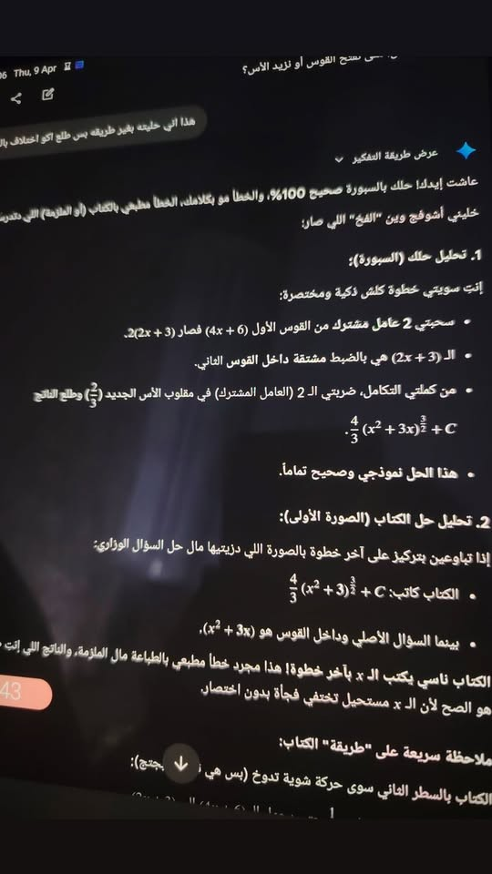

<!DOCTYPE html>
<html lang="ar" dir="rtl">
<head>
<meta charset="UTF-8">
<title>ملاك ❤️</title>

</head>
<body>

💖 قصة حب ما تنتهي 💖

<h1>ملاك</h1>

  
  
<b>الاسم:</b> ملاك

  
<b>تاريخ البداية:</b> 28/12/2025

ملاك مو مجرد بنت… هي أجمل شيء صار في حياتي أنا سعد.  
من يوم عرفتها وأنا أشوف الدنيا بألوان مختلفة، ضحكتها تنسيني أي هم، ونظرتها مليانة ثقة وهدوء يخلوني أحبها أكثر كل يوم.

<h2>جمالها</h2>

جمالها يفوق كل الكلام، ملامحها دقيقة ومتناسقة، كل حركة فيها تلفت الانتباه بطريقة طبيعية.  
ضحكتها لحالها تملك القدرة على إشراق اليوم كله، ونظرتها تكفي لتخلي القلب يخفق من الفرحة.

<h2>ذكائها</h2>

ذكاء ملاك شيء غير طبيعي… مو بس معلومات أو حفظ، ذكاءها يظهر في تصرفاتها وفهمها العميق لكل موقف.  
تستطيع حل أي مشكلة بطريقة هادئة، وتفكر بخطوات دقيقة قبل اتخاذ أي قرار.  
هي ذكية في كل شيء: في كلامها، في اهتمامها بالآخرين، وحتى في طريقة رؤيتها للحياة.  
ذكاؤها يرفع من قيمة كل لحظة معها، ويجعل أي شخص يقف مندهش أمام قدرتها على الموازنة بين الحب، الحياة، والطموح.

<h2>ثقتها بنفسها</h2>

ملاك قوية واثقة بنفسها… تعرف قيمتها وتستحق كل شيء جميل في الحياة.  
أنا أشوف فيها شيء كبير جدًا، شيء ما تتخيله أحيانًا، وأنا دايمًا أحاول أرفع من ثقتها بحبنا وبقدرتها على أي شيء.

<h2>دلعها واهتمامها</h2>

دلعها عليّ شيء مميز… أسلوبها بالكلام، اهتمامها اليومي، سؤالها عني، كلها أشياء تخلي قلبي يذوب.  
كل لحظة معاها أحس إني أهم شخص في حياتها، وهذا شعور لا يُقارن.

<h2>حبي لها</h2>

أنا أحب ملاك… حب كبير، حب عميق، حب يخليني أهيم فيها أكثر كل يوم.  
وجودها نعمة، وكل لحظة معها ذكرى لا تنسى ❤️

<h2>رسالة أخيرة</h2>

يا ملاك… أحبك من كل قلبي. أنتِ مو بس حبيبة، أنتِ روحي، أنتِ كل شيء جميل في حياتي.  
أهيم فيك، أقدّرك، وأؤمن بك، وسأقف دائمًا بجانبك مهما صار.  
وجودك معي يجعلني أفضل، ويجعل حياتي مليئة بالسعادة والأمل.  
أنا أحبك أكثر مما تتخيلين، وأهيم فيك أكثر مع كل لحظة تمر ❤️

</body>
</html>
